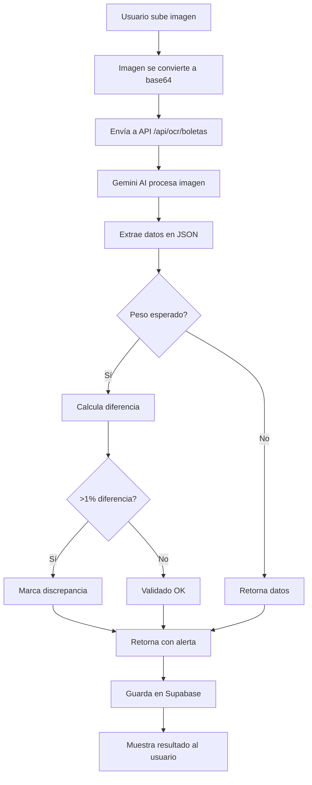

# Sistema de OCR para Boletas de Báscula

## 🎯 Descripción

Sistema automático de extracción de datos de boletas de báscula usando **Google Gemini AI** con detección de discrepancias y auditoría completa.

---

## ✨ Características

### 1. **Extracción Automática**
- ✓ Folio de boleta
- ✓ Peso bruto, tara y neto (conversión automática de toneladas a kg)
- ✓ Producto/grano
- ✓ Proveedor/productor
- ✓ Fecha y hora
- ✓ Humedad e impurezas (si están presentes)

### 2. **Detección de Discrepancias**
- Compara peso extraído vs peso esperado
- Umbral de tolerancia: **1%**
- Alertas visuales cuando hay diferencias significativas

### 3. **Auditoría Completa**
- Registro de todas las boletas procesadas
- Tracking de discrepancias
- Metadata de procesamiento (modelo IA, timestamps, usuario)
- Relación con entregas

---

## 🚀 Implementación

### Paso 1: Configurar API Key

Obtén tu API key de Google Gemini:
1. Ve a [Google AI Studio](https://makersuite.google.com/app/apikey)
2. Crea una nueva API key
3. Agrega a `.env.local`:

```bash
GEMINI_API_KEY=tu_api_key_aqui
```

### Paso 2: Crear Tabla en Supabase

Ejecuta el script SQL en tu proyecto de Supabase:

```bash
# Conéctate a tu proyecto
psql -h db.{project-ref}.supabase.co -U postgres

# Ejecuta el script
\i supabase-ocr-audit.sql
```

O copia y pega el contenido en el SQL Editor de Supabase.

### Paso 3: Usar el Componente

```tsx
import BoletaOCRUploader from '@/components/admin/BoletaOCRUploader';
import { ocrHelpers } from '@/lib/ocrHelpers';

function MiComponente() {
    const handleDataExtracted = async (data) => {
        // Guardar en Supabase
        await ocrHelpers.saveOCRResult(data, userId);
        
        // O usar los datos directamente
        console.log(data);
    };

    return (
        <BoletaOCRUploader 
            onDataExtracted={handleDataExtracted}
            pesoEsperado={45000} // Opcional: para detectar discrepancias
        />
    );
}
```

---

## 📊 Estructura de Datos

### Respuesta del OCR

```typescript
{
    folio: "BSC-2026-0234",
    peso_bruto_kg: 46500,
    peso_tara_kg: 1500,
    peso_neto_kg: 45000,
    producto: "Maíz Blanco",
    proveedor: "José García López",
    fecha: "2026-02-09",
    hora: "08:30",
    humedad: 14.5,
    impurezas: 2.1,
    validacion: {
        discrepancia: false,
        diferencia_kg: 0,
        porcentaje_diferencia: 0,
        peso_esperado: 45000
    },
    metadata: {
        procesado_en: "2026-02-09T08:35:00Z",
        modelo: "gemini-2.0-flash-exp"
    }
}
```

---

## 🔄 Flujo de Trabajo



---

## 🧪 Pruebas

### Página de Pruebas

Navega a `/admin/ocr-test` para probar el sistema:

```
http://localhost:3000/admin/ocr-test
```

### Casos de Prueba

1. **Boleta Normal**: Sube una boleta clara y completa
2. **Con Discrepancia**: Establece `pesoEsperado` diferente al real
3. **Baja Calidad**: Prueba con imágenes borrosas o parciales
4. **Formato Diferente**: Prueba con diferentes formatos de boletas

---

## 📈 Consultas y Estadísticas

### Obtener Auditorías

```typescript
import { ocrHelpers } from '@/lib/ocrHelpers';

// Todas las boletas con discrepancias
const discrepancias = await ocrHelpers.getAuditorias({
    discrepancia: true
});

// Búsqueda por folio
const boleta = await ocrHelpers.getAuditorias({
    folio: 'BSC-2026'
});

// Por rango de fechas
const recientes = await ocrHelpers.getAuditorias({
    fechaInicio: '2026-02-01',
    fechaFin: '2026-02-09',
    limit: 50
});
```

### Estadísticas

```typescript
const stats = await ocrHelpers.getEstadisticas();

console.log({
    total: stats.total,                          // Total procesadas
    conDiscrepancia: stats.conDiscrepancia,      // Con problemas
    sinDiscrepancia: stats.sinDiscrepancia,      // Correctas
    porcentaje: stats.porcentajeDiscrepancia,    // % de discrepancias
    pesoTotal: stats.pesoTotal                   // Suma total en kg
});
```

### Verificar Duplicados

```typescript
const check = await ocrHelpers.checkDuplicateFolio('BSC-2026-0234');

if (check.exists) {
    console.log('Boleta ya procesada:', check.existing);
}
```

---

## 🎨 Integración en Entregas

Para integrar en la página de entregas (`/admin/entregas`):

```tsx
import BoletaOCRUploader from '@/components/admin/BoletaOCRUploader';

// Dentro de tu modal o sección de validación
<BoletaOCRUploader 
    onDataExtracted={async (data) => {
        // Autocompletar campos de la entrega
        setFormData({
            folio: data.folio,
            peso_neto: data.peso_neto_kg,
            producto: data.producto,
            productor: data.proveedor,
            humedad: data.humedad,
            impurezas: data.impurezas,
        });
        
        // Guardar auditoría
        await ocrHelpers.saveOCRResult({
            ...data,
            entrega_id: entregaActual.id,
            imagen_url: imageUrl
        });
    }}
    pesoEsperado={entregaActual.peso_esperado}
/>
```

---

## 🔧 Personalización

### Cambiar Modelo de IA

En `app/api/ocr/boletas/route.ts`:

```typescript
const model = genAI.getGenerativeModel({ 
    model: 'gemini-2.0-flash-exp'  // Cambia aquí
});
```

Modelos disponibles:
- `gemini-2.0-flash-exp` - Rápido y eficiente (recomendado)
- `gemini-1.5-pro` - Más preciso pero más lento
- `gemini-1.5-flash` - Balance entre velocidad y precisión

### Ajustar Tolerancia de Discrepancia

En `app/api/ocr/boletas/route.ts`, línea 89:

```typescript
const umbral_tolerancia = pesoSistema * 0.01; // 1% actual
// Cambiar a 0.02 para 2%, 0.005 para 0.5%, etc.
```

### Modificar Prompt de Extracción

Edita el prompt en `app/api/ocr/boletas/route.ts` para:
- Agregar más campos
- Cambiar formato de salida
- Ajustar instrucciones de conversión

---

## 📝 Mejores Prácticas

### Para Mejores Resultados OCR

1. **Iluminación**: Luz uniforme sin sombras
2. **Enfoque**: Imagen nítida y legible
3. **Encuadre**: Boleta completa sin cortes
4. **Resolución**: Mínimo 1200x800 px
5. **Formato**: JPG o PNG (evitar PDF)

### Para Producción

1. **Rate Limiting**: Implementa límites de llamadas a la API
2. **Caché**: Guarda resultados para evitar reprocesar
3. **Validación**: Verifica datos críticos manualmente
4. **Backup**: Almacena las imágenes originales
5. **Logging**: Registra errores y casos edge

---

## 🐛 Troubleshooting

### Error: "GEMINI_API_KEY not found"

```bash
# Verifica que la variable esté definida
cat .env.local | grep GEMINI

# Reinicia el servidor
npm run dev
```

### Error: "Failed to parse JSON"

- La IA podría estar retornando markdown
- Revisa la consola para ver la respuesta raw
- Ajusta el prompt si es necesario

### Baja Precisión

- Mejora la calidad de la imagen
- Usa un modelo más potente (gemini-1.5-pro)
- Ajusta el prompt con ejemplos específicos

---

## 📦 Archivos Creados

```
├── app/
│   ├── api/ocr/boletas/route.ts      # API endpoint
│   └── admin/ocr-test/page.tsx       # Página de pruebas
├── components/admin/
│   └── BoletaOCRUploader.tsx         # Componente React
├── lib/
│   └── ocrHelpers.ts                 # Funciones helper
├── supabase-ocr-audit.sql            # Schema de BD
└── .env.local                        # Variables de entorno
```

---

## 🚀 Next Steps

1. ✅ Configurar API key de Gemini
2. ✅ Ejecutar migration SQL en Supabase  
3. ✅ Probar en `/admin/ocr-test`
4. 🔄 Integrar en página de entregas
5. 🔄 Agregar storage de imágenes en Supabase
6. 🔄 Implementar notificaciones de discrepancias
7. 🔄 Dashboard de estadísticas OCR

---

## 📚 Referencias

- [Google Gemini API Docs](https://ai.google.dev/docs)
- [Supabase Storage](https://supabase.com/docs/guides/storage)
- [Next.js API Routes](https://nextjs.org/docs/app/building-your-application/routing/route-handlers)

---

**¿Necesitas ayuda?** Revisa los logs en la consola del navegador y del servidor para más detalles sobre errores.
